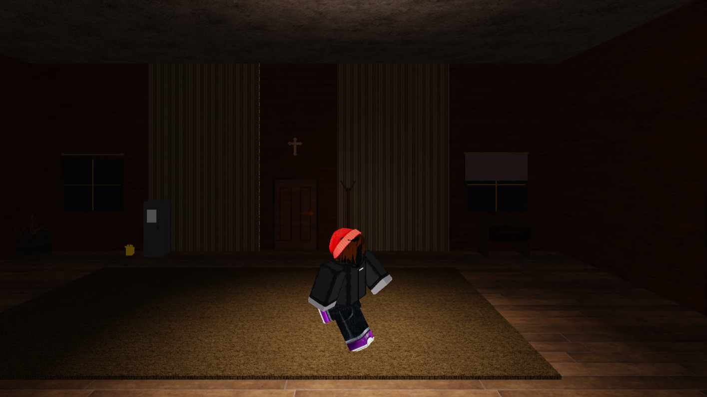
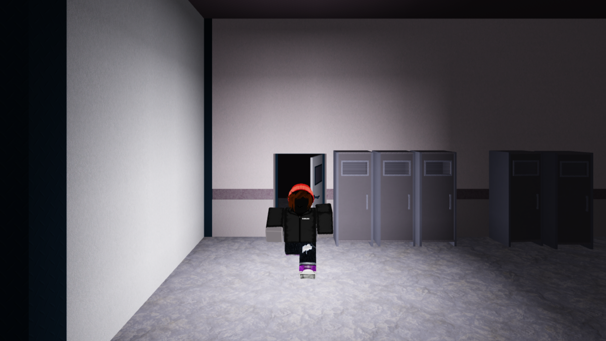
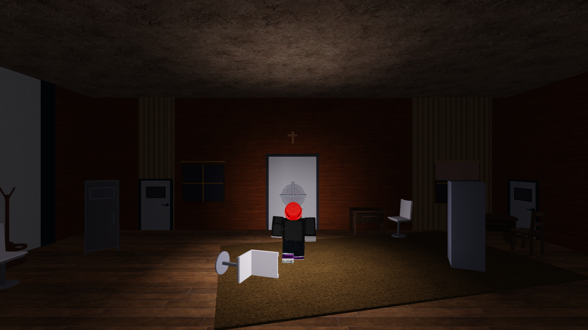
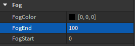

# PROJECT: Open Light
Roblox Game Project - Progress 100% 
<a href="https://www.roblox.com/games/12990580350/Project-Open-Light">Link to Game</a> 
<a href="https://www.youtube.com/embed/ARzfAvzwlfg">Link to Gameplay video</a>

<h2>Description</h2> 
Lost in a place that looks like your home, but is it really? 
Explore and get to the end before it gets to you. 
 

 
Goal of the game is to get to the end of the map and open the big door. Can you survive when it hunts though? Hide in lockers and wardrobes from it when the lights turn off. 
 

 
Movement: WASD 
Interaction: Left mouse button (the cursor icon changes when hovering over an interactible object) 
 
Big thank you goes to my friend <a href="https://github.com/Plawro">Plawro</a> who helped me with a few scripts and with a little bit of building. I also thank <a href="https://github.com/Kyom9393">Kyom9393</a> for building the locker model that can be seen at the Main Room, it looks horrible. 
 

 
This game was created as a school project! There is much more to come (hopefully) after I get this graded :] 
 
<h2>How to play/open</h2> 
Game playable on Roblox. Roblox can be downloaded by clicking play and then a download window comes up. To view scripts Roblox Studio must be downloaded. 
<a href="https://www.roblox.com/create">Link here</a>. Click "Start creating" to download Roblox Studio. 
Download the PROJECT Open Light.rbxl file and open it in Roblox Studio. (Game is dark, go to Lighting and remove the Skybox. Fog can be turned off in Lighting Properties. 
 

Set the FogEnd number to 10000. 

<h2>Update Logs</h2> 
<h4>31.3. 2023 - Project start</h4> 
- added fixed side-view cam 
<h4>5-6.4 2023 - Adding Rooms</h4> 
- added Main Room var 1 
- added Living Room 
- added a bunch of custom models 
<h4>7-17.4 2023</h4> 
- added more rooms (Bathroom, Dining Room, Attic, etc.) 
- added more custom models 
- came up with a name :) 
<h4>18-27.4 2023</h4> 
- whole map done 
- added even more models (no way) 
- getting ready for scripting  :skull: 
- accepted help from <a href="https://github.com/Plawro">Plawro</a> 
<h4>28-30.4 2023</h4> 
- added Light (Thank you <a href="https://github.com/Plawro">Plawro</a> for help) 
- added Fog 
- added Death screen 
- Made process on Hunt Event script 
<h4>1.-8.5 2023 - Finishing Touches</h4> 
- finished Hunt event 
- added Sky 
- added Ending 
- added two easter eggs dedicated to my helpers <a href="https://github.com/Plawro">Plawro</a> and <a href="https://github.com/Kyom9393">Kyom9393</a> 
- GAME PUBLISHED YIPPEE 
- bug fixing + more 
 

